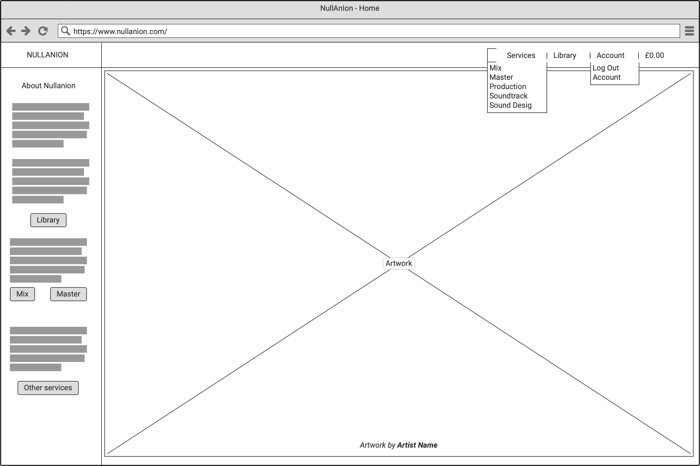
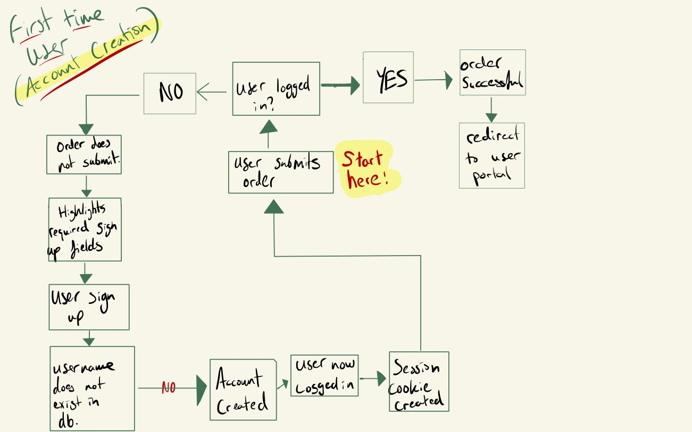
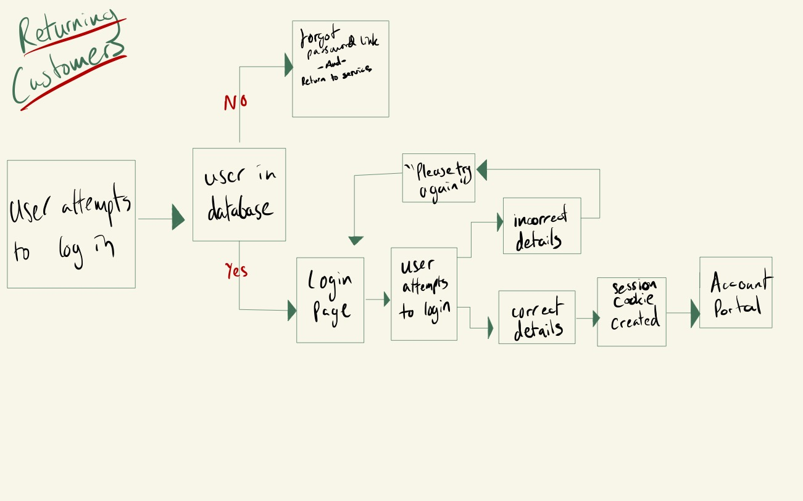
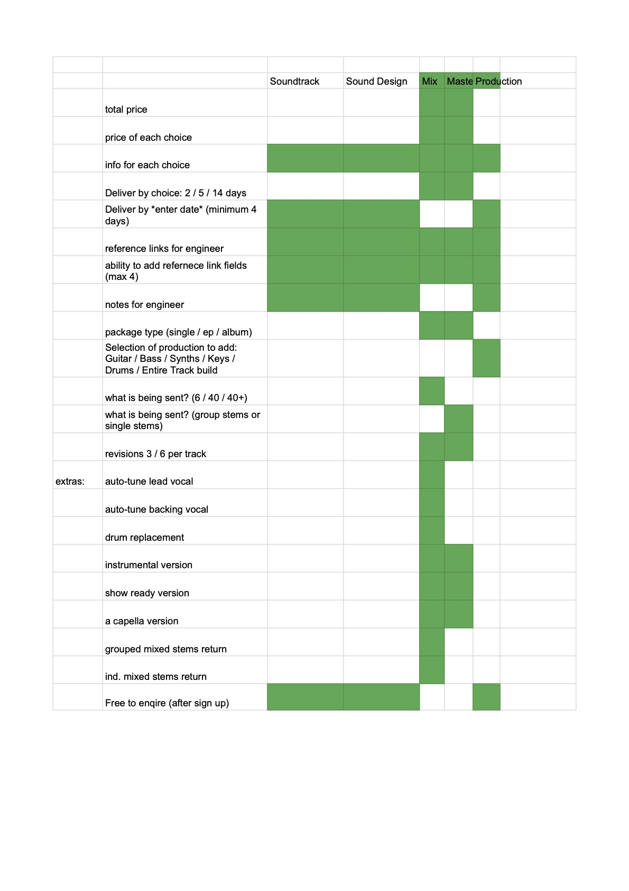

# Nullanion

## Live site [HERE](https://nullanion.herokuapp.com/)


Nullanion offers music services for those that need quality, delivered on time.

At Nullanion, one can order a mix or master of a song, EP or full length LP (Album). Another service of Additional Production is on offer also. Follow the form for each service to customise your order down to revisions and next day delivery, then order. After purchase, upload your stems directly to your engineer or producers computer.

## Contents

1. [UX](#UX)
    - [Project Goals](###Project-goals)
    - [Target Audience Goals](###Target-Audience-Goals)
    - [Site Owner Goals](###Site-OwnerGoals)
    - [User Stories](###User-Stories)
    - [User Requirements and Expectations](###User-Requirements-and-Expectations)
        - [Requirements](####Requirements)
        - [Expectations](####Expectations)
2. [Design Choices](###Design-Choices)
    - [Fonts](###Fonts)
    - [Icons](###Icons)
    - [Icons](###Colours)
    - [Styling](###Styling)
    - [Images](###Images)
    - [Backgrounds](###Backgrounds)
3. [Planning](##Planning)
4. [Wireframes](##Wireframes)
    - [Website Layout](###Website-Layout)
    - [Account Creation Flowchart](###Account-Creation-Flowchart)
    - [Database Design](###Database-Design)
5. [Features](##Features)
    - [Existing Features](###Existing-Features)
    - [Features Left to Implement](###Features-Left-to-Implement)
6. [Technologies Used](##Technologies-Used)
7. [Testing](##Testing)
8. [Bugs](##Bugs)
    - [Persitant Bugs](##Persistant-bugs)
9. [Deployment](##Deployment)
10. [Deploying to Heroku](##Deploying-to-Heroku)
11. [Deploy Locally](##Deploy-locally)
12. [Credits](##Credits)

## UX

### Project Goals

The Nullanion project's purpose is to offer multiple music services to customers that need high quality delivery on mix, master or additional production products. Customers will be able to create a bespoke order, pay their quote, communicate with their engingeer and upload / download high quality files. All in an easy to follow user journey and secure environment.

[Back to Top](##Contents)

### Target Audience Goals

- See reference material of previous work in all fields.
- Select a service from a list.
- Customise order and get real time updates on quote price with each change.
- Pay securely for services.
- Communicate with their engineer on edits / references / progress.
- Navigate the website easily on any device size.

[Back to Top](##Contents)

### Site Owner Goals

- Create a safe and secure e-commerce site, that can generate revenue.
- Provide clear pricing and service descriptions.
- Demonstrate industry experience to users via a showcase/library area.
- Maintain account product history for optimising future experiences.
- Use work generated from sales as examples on the site.

[Back to Top](##Contents)

### User Stories

#### First-time user

1. As a user and as a first-time user, I want to quickly and easily navigate around the site to understand what this company does / can do for me without needing to give any credentials.
2. As a user and as a first-time user, I want to hear examples of work.
3. As a first-time user, I want to select a service and follow an easy to use form to customise my order.
4. As a user and as a first-time user, I want to make sure I can create an account before I pay to ensure a relation between my order and my account.
5. As a user and as a first-time user, I want to make sure that after I pay, I get a confirmation of payment and follow up instructions.
6. As a user and as a first-time user, I want to make sure that after I have paid, my files can be uploaded securely to a reputible source.
7. As a user and as a first-time user, I want to have an instant and easy communication process with the engineer working on my material over email.

#### Returning Customer

1. As a user and as a returning customer, I want to be able to log in to an account to see my orders.
2. As a user and as a returning customer, I want to be able to easily communicate with my engineer over email.
3. As a user and as a returning customer, I want to only share relevant personal details.
4. As a user and as a returning customer, I want to take delivery of versions of my order easily.
5. As a user and as a returning customer, I want to be able to share notes and suggested edits on versions easliy with the engineer.

#### Engineer (Super User)

1. As a user and as an engineer, I want to be able to receive an order in an understandable format.
2. As a user and as an engineer, I want to be able to access the user files to work on as soon as the order opens.
3. As a user and as an engineer, I want to see a clear deadline for an order.
4. As a user and as an engineer, I want to see reference text and links from the customer.
5. As a user and as an engineer, I want to be able to communicate directly with the customer.
6. As a user and as an engineer, I want to be able to upload versions to the customer.

[Back to Top](##Contents)

### User Requirements and Expectations

Audio art is an amazingly personal product and achieving the techincal requirements to present it publicly have grown more accessible than ever, however, some artists require more experienced technical engineers to get the best out of their creations. Luckily, these days, experienced engineers can be reached from all over the world.

Proving some experience and a legitiate web site to sell these services is the number one priority in creating long lasting customer relationships and quality services.

#### Requirements

- An easy to use design.
- Access to all features on all screensizes.
- Safe purchasing of products.
- Feedback of purchase success / failure.
- Communicate with business.

#### Expectations

- The website will not store customers payment details in the database.
- The website will uphold the privacy and expected security of customer personal data.
- The website will be usable on any viewing screen.

[Back to Top](##Contents)

## Design Choices

There are three main form flows to the site. Styling was important - custom icons were designed by [Mikey Rosenfeldt](https://vimeo.com/michaelrosenfeldt). The main aim here was to not allow the site to appear too drearey. With a clear, off white flow design of wave forms.

[Back to Top](##Contents)

### Fonts

#### Title logo


The font for the title was a bespoke creation by [Mikey Rosenfeldt](https://vimeo.com/michaelrosenfeldt) and the complimenting font of [Raleway](https://fonts.google.com/specimen/Raleway?preview.text_type=custom) was used for other text across the site.

[Back to Top](##Contents)

### Icons

More bespoke creations made for the forms were the icons.


[Back to Top](##Contents)

### Colours

The main colour pallete is between these two tones:


[Back to Top](##Contents)

### Styling

### Images & Backgrounds

Images are mainly used as backgrounds to facilitate the flow of audio creation.


[Back to Top](##Contents)

## Wireframes



I used [Goodnotes](https://www.goodnotes.com/) to hand draw the wireframes and user flows before commiting anything to [balsamiq](https://balsamiq.com/) for digital recreation. This process always helps to iron out the things you dont think of before commiting to the code. Exporing the wireframes was easy using Balsamiq, and you can find them all here:

[Wireframes Folder](https://github.com/lornebb/NullAnIon/tree/master/static/wireframes)

[Back to Top](##Contents)

### Website Layout

[Back to Top](##Contents)

### Account Creation Flowchart

Account creation is different to anything I have done before as users don't need an account unless they are purchasing. So the account creation has to be executed during the checkout process. I drew a user flow to help easily explain this. This was hand made with [Goodnotes](https://www.goodnotes.com/).



[Back to Top](##Contents)

### Returning Customer Account Flowchart

Returning customers that want to check up on an order, or share notes / feedback on a revision will need to use a log in / forgotpassword portal, that also has some defensive measures built in to only allow users to log in, and not create a new account. Also, a forgot password link will be available. This was hand made with [Goodnotes](https://www.goodnotes.com/).



[Back to Top](##Contents)

### Database Design

Relational databse models were new to me, however, there were some very noticable similaries between what I wanted to save and present within the three serices, a quick chart in gSheets made it clearer to me how to proceed with building the models.



After reviewing these, it seems apparent to me to focus my attention on the mix, master and production models, leaving the sound design and sound track services as options for further development in the future.

[Back to Top](##Contents)

## Features

### Existing Features

- Order a mix - allows users to create a bespoke order for a song / ep or album by following the form and submitting it to the checkout.

- Order a master - allows users to create a bespoke order for a song / ep or album by following the form and submitting it to the checkout.

- Order a Production - allows users to create a bespoke order for a song / ep or album by following the form and submitting it to checkout.

- Create profile by signing up and creating an account.

- Profile to see order progress and orders that have been purchased.

[Back to Top](##Contents)

### Features Left to Implement

- Option for multiple engineers to create some sort of 'engineer profile' to market themselves to their own clients / get their own work / get their own income stream.
- Extended artist profile of Nullanion back catalogue.
- More services offered - such as live event engineer services or on-location studio tracking.
- Collaboration portal.
- Other art types showcased / service offers - eg artwork, music video etc
- Darkmode
- Interactive home page artworks.
- more fluid pricing and auto updating pricing structre.
- uploading files from clients directly to the site.
- Alternatively - auto generating dropbox links to send bespoke, named and private dropbox locations for upload.
- integration with ProtonMail and ProtonCalendar for encryption of communication.
- More services offered.

[Back to Top](##Contents)

## Technologies Used

### Languages

- [HTML](https://developer.mozilla.org/en-US/docs/Web/HTML)

- [CSS](https://developer.mozilla.org/en-US/docs/Web/CSS)

- [JavaScript](https://www.w3schools.com/js/)

- [Python](https://www.python.org/)

- [JSON](https://www.json.org/json-en.html)

### Libraries / Frameworks

- [Django](https://www.djangoproject.com/)

- [Bulmer](https://bulma.io/)

- [jQuery](https://jquery.com/)

- [SQLite](https://sqlite.org/index.html)

- [Postgres](https://www.postgresql.org/)

### Tools

- [Git](https://git-scm.com/)

- [Heroku](https://www.heroku.com/)

- [PIP](https://pip.pypa.io/en/stable/installing/)

- [BOTO](https://boto3.amazonaws.com/v1/documentation/api/latest/index.html)

- [FLAKE8](https://flake8.pycqa.org/en/latest/)

[Back to Top](##Contents)

## Planning

Since a lot of the technologies I used in this project are brand new to me, planning in the intitial phases were very important. Making sure that wireframes, user stories, user journies and expected outcome had their expectations managed, was my top priority.

I knew I wanted to make a website to provide a portal for musicans to purchase these services, so as long as that goal is met then I'd be happy.

A brand had to be created for the look and the intricicies of the service I wanted to provide had to be understood before any code was written.

After that, the info panels on the left needed to be created to ensure users knew where they were and what was going on.

[Back to Top](##Contents)

## Testing

### Library

> As a first-time user, I want to quickly and easily navigate around the site to understand what this company does / can do for me without needing to give any credentials.

-also-

> As a first-time user, I want to hear examples of work.

- **Plan**

When a user visits the page, information is available to them to view and get an understanding of what is on offer, without having to share any personal details.

- **Implementation**

The landing page is clean and free of clutter, so when a user lands there, they are free to click around and discover what they need. the info panels on the left display what is on offer, and invite the user to visit the library page. Upon arival there, the user is presented with a list of songs that showcase the skills of Nullanion services, all without having to share any personal details.

- **Test**

1. Arrive to site:
    1. Arrive on landing page, view info panels on left.
    2. Click on 'Library'.
    3. View on list of songs.

2. It is also possible at this point to click through on songs to their spotify origins:
    1. Hover over the artwork of the song.
    2. Ensure that the image fades to a spotify icon, click.
    3. Ensure that the link follows to a spotify listing in a new tab.

- **Verdict**

The test works as planned and has therefore passed.

[Back to Top](##contents)

### Order a Mix, Master or Production

> As a first-time user, I want to select a service and follow an easy to use form to customise my order.

- **Plan**

When a user visits their desired order form page, following the form in a logical manner will be the most logical route to completing an order.

- **Implementation**

Each form is created with bespoke icons to simplify the experience and streamline the user to a complete order. Hopfully inviting them to explore more interesting ways to ask for the service.

- **Test**

1. Select a service from the services dropdown in the nav bar:
    1. Arrive on desired form, ensure that layout is of suitable readablity with icons displayed for options for radio selectors.
        1. Ensure that, should you not already be logged in, a warning box appears at the top of the form, with links to log in or sign up. This is not needed for this test, but ensure that it is there.
    2. Fill out forms.
    3. Ensure that each required field is filled.
        1. If required field is not filled in, ensure that form can not be submitted.
        2. Ensure that the total price is displayed and can not be altered.
    4. Submit form.
    5. Sucessful submission will bring you to the checkout page.
        1. Ensure that order details that you just filled out have been carried onto the checkout page.
        2. Ensure that the price displayed on the form page is reflected in the checkout total price order field.

- **Verdict**

The test works as planned and has therefore passed.

[Back to Top](##contents)

### Checkout and Paying

> As a first-time user, I want to make sure I create an account before I pay to ensure a relation between order and my account.

-also-

> As a first-time user, I want to make sure that after I pay, I get a confirmation of payment.

-also-

> As a first-time user, I want to make sure that after I have paid, my files can be uploaded securely to a reputible source.

-also-

> As a first-time user, I want to have an instant and easy communication process with the engineer working on my material over email.

- **Plan**

This is the crucial part of the experience, a safe and secure checkout and feedback about what happens next. This needs to be secure, easy to use and instant. The form should only be able to tbe completed by users signed in and registered with a validated email address - this makes sure that the verification, upload, and confirmation correspondance goes to the correct person.

- **Implimention**

Using python and stripe in the design and model forms ensuring form validation the form should not submit without the required fields and a log in required. The file upload link will give the user direct access to a secure upload folder for their files.

- **Test**

1. After completeing a mix / master form, follow through to checkout page.
    1. Complete an order form while NOT being logged in. Submit the order for and at the checkout page, try to complete order without entering any personal or financial details.
        1. Ensure that the submit button or stripe card payment boxes are not present.
    2. If that is unsucessful, sign in or register, either using the links provided on checkout, or navigate there using the nav bar.
        1. After sign in or register, ensure that you are redirected to a profile page where you can update / check your contact information.
    3. Navigate back to to the service you want and follow it through to checkout.
    4. Ensure that a personal detail form is now present and that a card details field is visible.
        1. Try to checkout without filling any details in - ensure this is not possible by html valididation errors.
    5. Fill out your personal details.
        1. Try to complete order without financial details entered.
    6. Fill in the trails card details (4242 4242 4242 4242) and submit form.
    7. Ensure that you are presented with a loading screen before being redirected to a completed order page, a link to your dropbox to upload your files to, and an email address for contact, including instructions with how to upload your files.
        1. Ensure that your order details are presented on this page also.
    8. Ensure that your inbox has an email with a greeting and the exact same details for file upload for files.

- **Verdict**

The test works as planned and has therefore passed.

[Back to Top](##contents)

### View Previous Orders

> As a user and as a returning customer, I want to be able to log in to an account to see my orders.

- **Plan**

After a user has submitted an order, they must be able to go and cheeck that order on their user profile, and see the instructions needed to complete or conatct the engineer working on their order, should they lose or misplace their confirmation email.

- **Implimention**

On completion of an order, the order is saved to the databasem along with a tag of the user that created it, meaning that on a user profile, that user can go back and see their previous orders.

- **Test**

1. After sucessfully completing and order (by following the steps above) and LOGGING OUT OF YOUR ACCOUNT:
    1. Return to the site and click on ACCOUNT in the nav bar.
        1. Ensure that you see CREATE ACCOUNT and SIGN IN only.
    2. Select SIGN IN, and sign in.
        2. This is a good opportunity to test / check other security features like forgot password, too.
    3. On sign in ensure that you are redirected to your profile page.
    4. Ensure that your contact and profile details are present.
    5. Ensure that you see a form with your previous orders in it.
    6. click the order number of your previous order, and ensure that the details remain the same.

- **Verdict**

The test works as planned and has therefore passed.

[Back to Top](##contents)

----

## Bugs

### WebHook issues

During development, espescially during the implimentation of the Stripe Webhooks, the webhook calling variables in heroku, my local env file and gitpod we're all different, losing track of these left very confusing issues on concequenting sessions. The mix up of variables, led to emails not being sent out, and some order confirmation emails to send hours and hours later. Once it was cleaned up, the system worked fine again, but it was days of confusion, then even more time deep diving into the repo history to find where the errors were coming from.

### JS / Jquery and the missing functions

Creating the onclick function of the order form to fire the multitude of various checks and user feedback moments was made increasingly difficult as the simple jquery function ```useToggle()``` was throwing a console error as ```not a function```. After hours of peer-led support and dozens of stack overflow articles later... I decided to build the function myself. Assuming that this was an unsupporrted Jquery function that had gone undocumented. It was about half way through the build that I realised the build of JQuery I was calling in via CDN was a slim version. Changing this to a full-fat build fixed the problem. I couldn't believe it, but it happened.

### Broken admin order panel

This bug took an entire week of my life. And, as above, it was a painfully simple error to fix. After making changes to the Order Model, migrating, and attempting to save new data to it, I came across a database error every single time I tried to access that table. I even couldnt access the orders from the admin screen either. The error came back with a missing field in the database.

Assuming it was a models error, I remade the models, migrated... no success.

Assuming it was a database error, I switched off the postgres link in my env, and tried on SQLite. No success.

Assuming something had migrated in the history that was now corrupted, I rolled back a few days, again, no success.

So I deleted the postgres database and wiped the SQLite database. re-mirgrated... no success.

Honestly, this was a low point.

To cut a long story short, it was a field I was asking to display in the admin panal that was causing it. 5 characters. I couldn't believe it. Once this field was deleted in the admin panel, no more errors of this kind occured again, and my hair is thinner forever.

[Back to Top](##Contents)

## Persistant bugs

### Duplicate orders

The persistant bug in the project is an issue with duplicate orders being created, most likely due to the webhook handler not breaking if the order already exists. At the moment, database entires are filled in half by the checkout/views.py and the other half with Stripe data (such as PID and 'original bag') by the webhook handler. These duplicates also carry a default created on date, rather than the future date the user specifies. Luckily, data that the user enters IS saved in the original instance of the save by the view, so orders can still be carried out. However, this bug definitely needs to be streamlined before taking the store to a public facing position.

### Slow load of images

The slow loading of images in the library page is a bug that needs to be fixed, originally the data was going to be stored in dropbox as large .wav files would also be streamed through the site, and to allow any admin of the site to add content to the site without needing any coding experience. However, this seem inefficient for scale, as data load from dropbox is noticable slower than all other content on the site. The overlay to spotify play is also suffering due to this bug. So, in order to fix this, I need to impliment a way for admins to add images and files to the AWS bucket instead of linking images from all over the internet.

### First load of user data not found

There is another inconsistantly occuring, but still persistantly present bug observed by myself but also reported by testers involving their data and previous orders not being saved on account creation, and then sometimes concequently, not laoding or pre-loading into forms around the site. I think it has something to do with the way the user is redirected after creating an account (to the log in page instead their profile) and then concequently being redirected back to their profile after logging in (instead of the home page). These are features that ive tried to edit around to find the problem, ut left the current production build as redirect to profile after log in due to the ease of the user flow.

[Back to Top](##Contents)

## Deployment

Nullanion was developed on VS Code code, using Git and GitHub for version control. the runnable version is hosted on Heroku with static and media files stored in an AWS S3 Bucket. While the below will work on any computer, the commands are geared towards osXI on M1, as that is the build of machine this was conducted on.

### Running locally

For a local deployment you will need an IDE (I used VS Code, as mentioned above), and also PIP, Python3 (3.+) and Git.

To ensure you have all the required tools on your machine use the following commands.

Check your pip version with: ```python3 -m pip --version```

Check your python version with: ```python -V```

check what version of Git you are running with: ```git --version```.

Download the repo above by clicking on the CODE button in the top right of the file tree, and selecting Download ZIP, now extract the files into your chosen location and open in your IDE.

You will need to create a lightweight virtual environment for python with: ```python -m venv <name of env>```

And every time you open the project, should you choose to close it, be sure to change back to this env, use: ```source <name of env>/bin/activate```.

At this point, you will need to set up your env.py file, add it to the git ignore list to ensure it never ends up in version control, but this time the database url is optional, since you will want django to default to the SQLite3 database that comes with django. The settings in the settings.py file will make sure of this, if the env is not present.

```python
os.environ.setdefault('DEVELOPMENT', '1') # This 1 will ensure that you are always in development mode when working locally.
os.environ.setdefault('SECRET_KEY', '')
os.environ.setdefault('DATABASE_URL', '')
os.environ.setdefault('AWS_ACCESS_KEY_ID', '')
os.environ.setdefault('AWS_SECRET_ACCESS_KEY', '')
os.environ.setdefault('STRIPE_PUBLIC_KEY', '')
os.environ.setdefault('STRIPE_SECRET_KEY', '')
os.environ.setdefault('STRIPE_WH_SECRET', '')
```

Notes on where these variables are found:

- (Your stripe secret keys are found in your stripe account on your dashboard.)
- (Email vars are found in your email provider. For gmail you will need to set up an app password.)
- (Database key is found in your Heroku account once you have set up your Postgres database.)

Before starting the server, make sure to make migrations, check then, then migrate with this:

```python
python3 manage.py makemigrations --dry-run
# check that the output is desired, if so:

python3 manage.py makemigrations
#check that this was executed sucessfully, then:

python3 manage.py migrate --plan
#check that the plan is as desired, if so:

python3 manage.py migrate
#check that this was completed successfully.
```

Now the database has been created and migrated properly, you can run the server and run the project locally with the command:

```python
python3 manage.py runserver
```

Click on the link / copy and paste the port that has been opened in the CLI to open a browser tab with the project running in it.

You are up and running!

### Deploying to Heroku

Firstly, create a Heroku account. Select start a new app and choose the location closest to you as a server. Select an appropriate name and create it. At this point you need to select POSTGRES from the resources tab, then move to the deploy tab. Connect your github account and select your repo for automatic deployment. For extra documentation on this you can read it [here](https://dashboard.heroku.com/). You have no attached a database to your environment.

While you are in Heroku, be sure to go to settings and REVEAL CONFIG VARS - make sure that Postgres has been added automatically by Heroku.

Set up the rest of your config variables in Heroku for this project change each line to:

```python
os.environ.setdefault('SECRET_KEY', '')
os.environ.setdefault('DATABASE_URL', '')
os.environ.setdefault('AWS_ACCESS_KEY_ID', '')
os.environ.setdefault('AWS_SECRET_ACCESS_KEY', '')
os.environ.setdefault('STRIPE_PUBLIC_KEY', '')
os.environ.setdefault('STRIPE_SECRET_KEY', '')
os.environ.setdefault('STRIPE_WH_SECRET', '')
```

Notes on where these variables are found:

- (Your stripe secret keys are found in your stripe account on your dashboard.)
- (Email vars are found in your email provider.)
- (Database key is found in your Heroku account once you have set up your Postgres database.)
- (Your amazon AWS settings are explained below.)

In order for these to all work together, a few setting will need to be configured in your Github repo and your requirements.txt file. First of all make sure to install the required functionalities as written in the requirements.txt. (Especially DJ_database and psycopg2).

```pip
pip install -r requirements.txt
```

This should take care with any missing requirments in yoru machine. If any did not install, be sure to read what feedback your command line gives you with regards to why or where to get the dependancy.

Now is a good time to update your new database with the local SQLite data by typing:

```python
python3 manage.py makemigrations --dry-run # add the --dry-run flag first to make sure the right thing is happening
```

Assuming this shows no errors, follow up with

```python
python3 manage.py makemigrations
```

Now the migrations are ready to be migrated. Follow up with this command:

```python
python3 manage.py migrate --plan #make sure that this returns no errors
```

Assuming that went well, finally use:

```python
python3 manage.py migrate
```

Now you have all the data, you'll need access to it. So to create a superuser, use the command:

```python
python3 manage.py createsuperuser
```

Follow the on screen instructions to create a username, email and password. Write these down, they will be needed to log in to the site and access the ```/admin``` panel in the project.

#### AMAZON AWS

We now need to get you set up with storing the static and media files on amazon AWS so Heroku knows where to look for them. There is no easy way to explain this to be honest, but the best place to start is [this tutorial](https://django-storages.readthedocs.io/en/latest/backends/amazon-S3.html) and, if you are the sort that likes to read the manual, [get on it](https://docs.aws.amazon.com/AmazonS3/latest/gsg/CreatingABucket.html). Be sure to set up your bucket with PUBLIC ACCESS.

[Back to Top](##Contents)

## Credits

- All icon, background and logo designed by [Mikey Rosenfeldt](https://vimeo.com/michaelrosenfeldt), on commission.

- My peers [Chris Palmer](https://github.com/cgpalmer) and [Fran DeBoo](https://github.com/fdeboo) for so much helpful knowledge and guidance.

- My BFiC [Pauld](https://github.com/pauld0051) for his excellent google skills and helping me get past the line at the last minute!

- The ultimate thanks have to go to the excellent team at Tutor Support at Code Institute who helped me deep into the night with bugs and helping me figure out logic. Their help was invaluable to getting this project finished.

- [Simen Daehlin](https://github.com/Eventyret) who always goes above and boyond to help nme get my head around the bigger picture.

- The sticky footer in bulma fix code was inspired by [Philip Walton](https://philipwalton.github.io/solved-by-flexbox/demos/sticky-footer/)

- Datepicker element was found on this tutotirla by [Vitor Freitas](https://simpleisbetterthancomplex.com/tutorial/2019/01/03/how-to-use-date-picker-with-django.html).

[Back to Top](##Contents)
